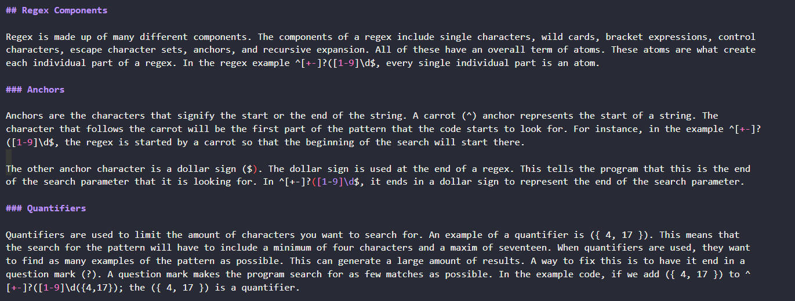

# Regex Tutorial



## Table of Contents  
* [Description](##Description)  
* [Installation](##Installation)  
* [License](##License)  
* [Contact](##Contact)  

## Description

This word document is a tutorial that explains how a specific regular expression, or regex, functions by breaking down each part of the expression and describing what it does. You'll use the template provided in the starter code to create your walkthrough.


## Installation

1. Clone the repo
   ```sh
   git clone https://github.com/hoeferg/Regex-Tutorial
   ```
2. Install NPM packages
   ```sh
   npm install
   ```
3. Start the application
   ```sh
   npm start


## License

No license

---

## Contact
Gayle Hoefer - [LinkedIn](https://www.linkedin.com/in/gayle-hoefer-61a2a3124/) - [Github](https://github.com/hoeferg)
